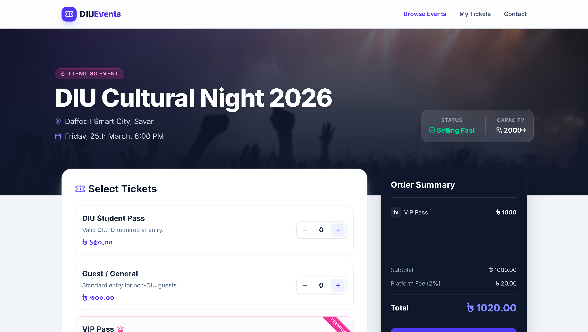

<div align="center">

  

  <br />
  <p><strong>A modern, responsive frontend application for booking campus event tickets with real-time price calculation.</strong></p>

  <p>
    
    
    
  </p>

</div>

---

## 🚀 Live Demo

🔥 **Check out the live project here:** 🔗 **[DIUEvents Live App](https://atul-dev-ai.github.io/diu-events/)



---

## ✨ Key Features

- **Real-Time Cart Calculation:** Dynamic ticket pricing, quantity adjustment, and automatic platform fee calculation using Vanilla JavaScript.
- **Glassmorphism UI:** Premium frosted-glass effects on the hero section and navbar for a modern look.
- **Mobile-First Responsive Design:** Fully optimized for mobile devices with a custom animated hamburger menu.
- **Interactive States:** Beautiful hover effects, disabled button states for empty carts, and visual feedback on user actions.
- **Developer Portfolio Integration:** Includes a visually striking developer bio section in the dark footer.

---

## 🛠️ Tech Stack

- **Markup:** HTML5
- **Styling:** Tailwind CSS (via CDN)
- **Icons:** Lucide Icons
- **Scripting:** Vanilla JavaScript (DOM Manipulation & Event Handling)

---

## 💻 Run Locally on Your Machine

Follow these steps to run and edit this project on your local computer:

**1. Clone the repository:**
```bash
git clone https://github.com/atul-dev-ai/diu-event-booking.git
```

```bash
cd diu-events
```

## 2. Open the Project:
Simply double-click the index.html file to open it in your browser, or use VS Code's "Live Server" extension for a better development experience.

---

## 👨‍💻 About the Developer
Developed with ❤️ by Atul Paul.

I am a software developer and student at Daffodil International University (DIU), passionate about Web Development, Generative AI, and Deep Learning.

📫 Connect with me:

GitHub: @atul-dev-ai

LinkedIn: Paul Atul

<p align="center">
<i>If you liked this project, please consider giving it a ⭐ on GitHub!</i>
</p>
